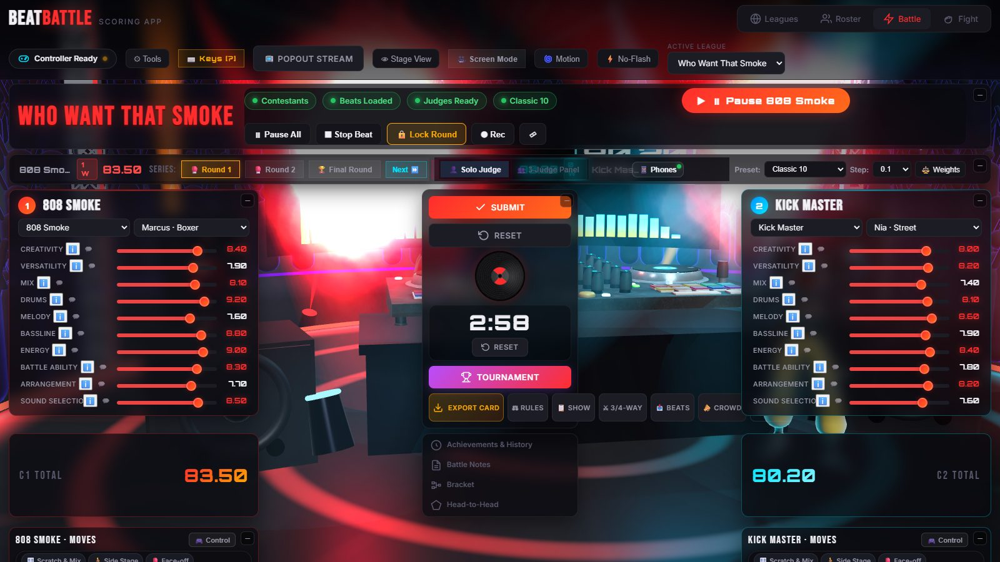
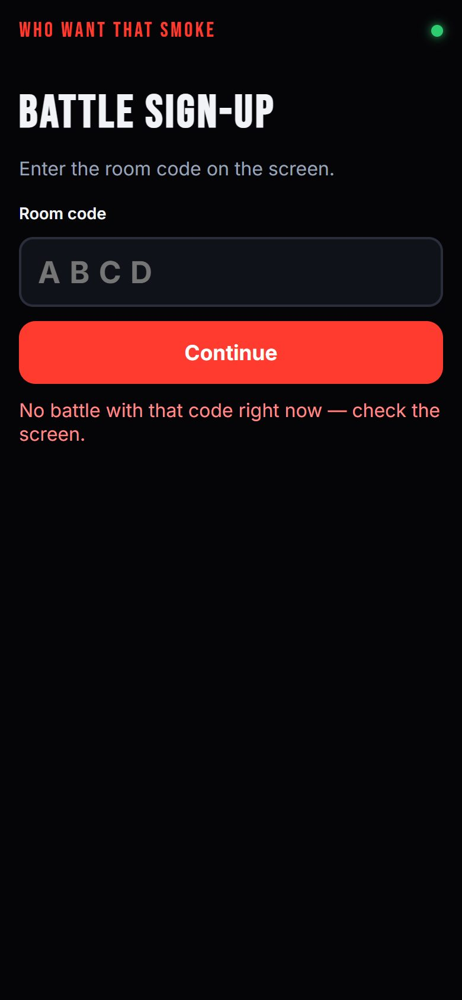
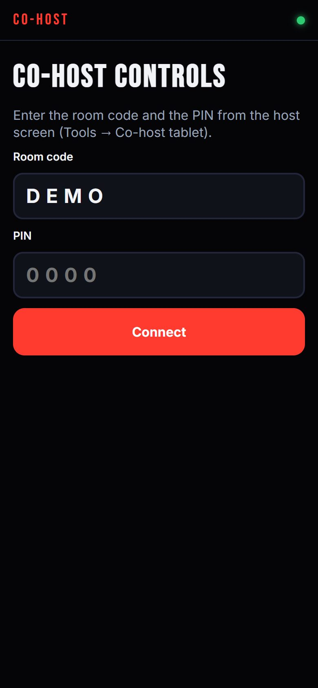
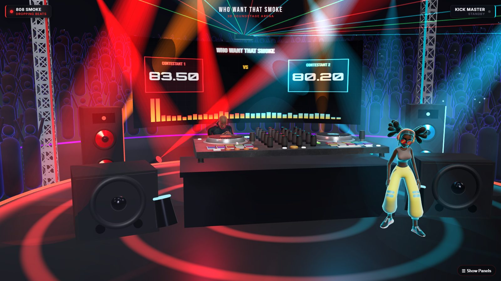
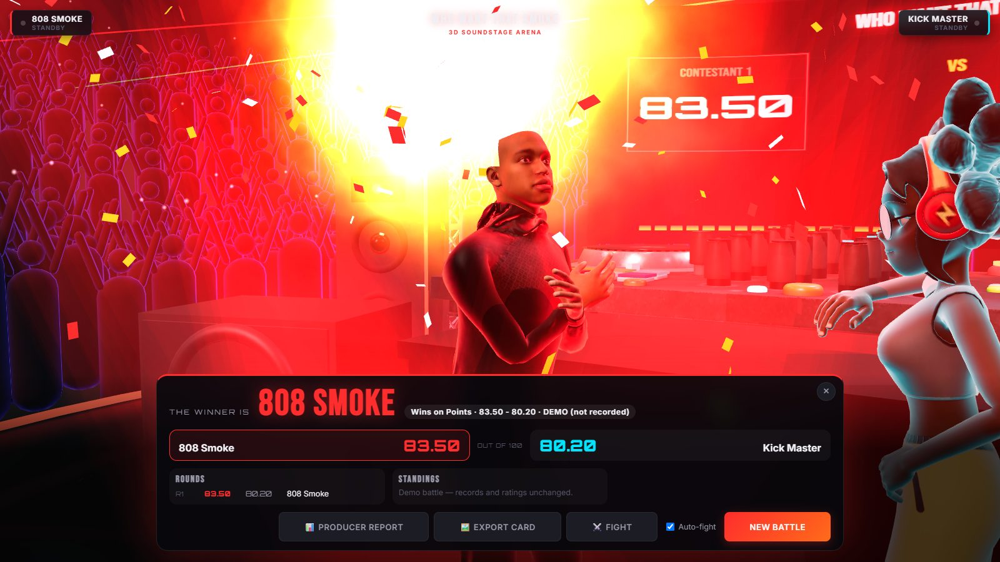
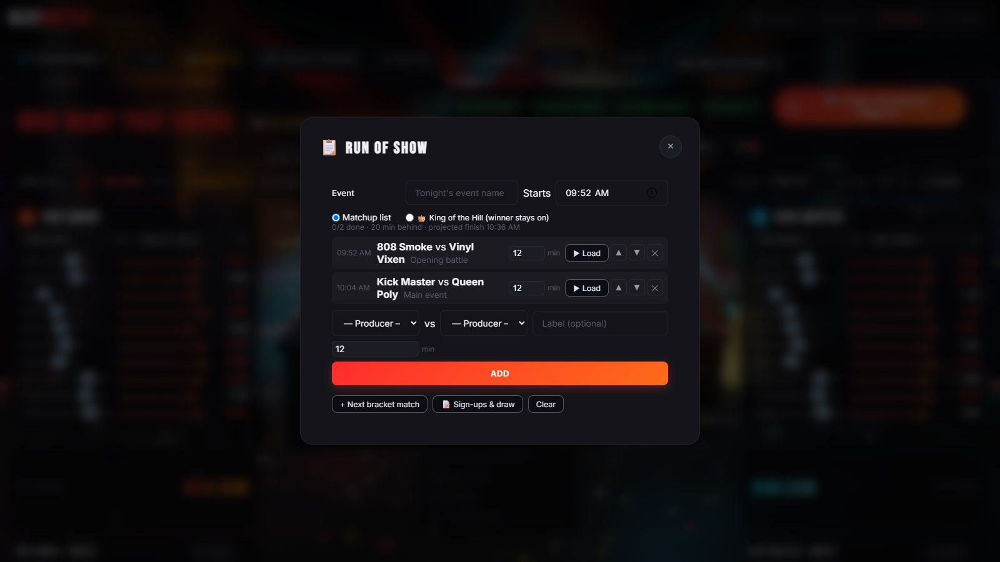
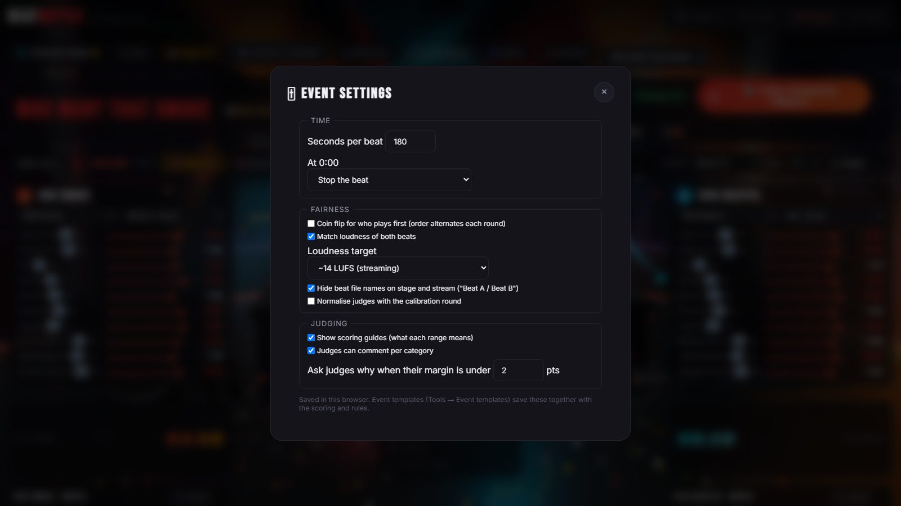
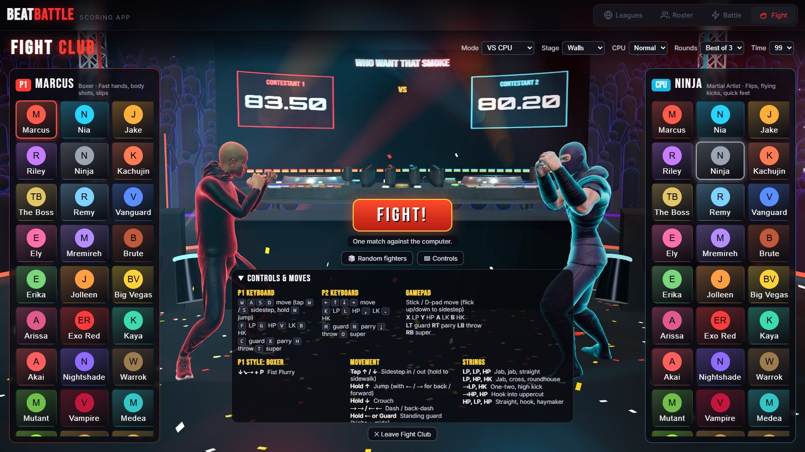
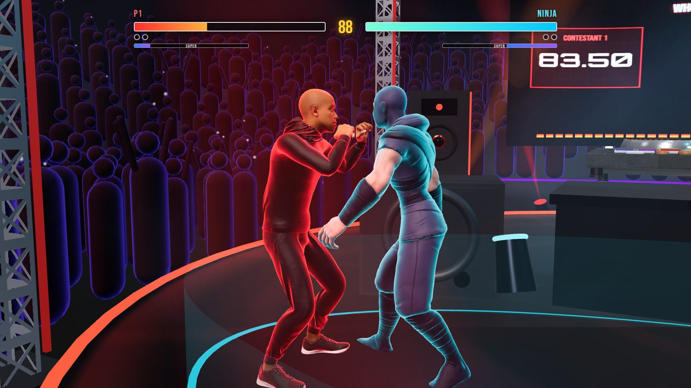

# BeatBattle 3D — "Who Want That Smoke"

[](https://vitejs.dev/)
[](https://threejs.org/)
[](#development)
[](#running-a-battle-night)

The complete toolkit for running a live **beat battle**: judging and scoring, a 3D stage show, phones for judges, the crowd and the producers, stream overlays, and the league behind it all — standings, seasons, stats and a public league page. Everything runs on one laptop on the venue Wi-Fi; no cloud account, no internet required.



---

## What it does

### 🎚 Run the battle
- **One-button battle flow** — soundcheck → beat A → beat B → lock the round → next round → reveal. The round timer follows the decks.
- **Best-of-3 series** with sudden-death overtime, a configurable tie-break chain, and **3- or 4-way battles** (shuffled order, ranked by the panel).
- **Flip rounds** — the original sample plays first, then both producers' flips.
- **Two DJ decks** in Web Audio: EQ, filter, echo, cue points, hot cues, real vinyl scratching, waveforms, BPM and key detection.
- **King of the Hill** nights and a **run of show** with time estimates, "12 min behind" tracking and a next-up card.

### ⚖️ Fair by design
- **Visible coin flip** for who plays first; the order alternates every round.
- **Loudness matching** (ITU-R BS.1770 LUFS) so the hotter master doesn't sway the judges.
- **Anonymous beats** — the stage and stream show "Beat A / Beat B"; blind judging hides names until the reveal.
- **Scoring guides** — what a 4, a 7 or a 10 means in every category, on the judges' phones.
- **Judge calibration** — everyone scores a reference beat; optionally normalise harsh and generous judges onto one scale.
- **Time limits** — stop, fade out, or let it run with penalty points.
- **Corrections log** — reopening a locked round needs a reason, kept with the record and in the producer report.
- **Judge consistency stats** — who scores outside the panel, slot bias, favourites.

### 📱 Phones for everyone (local Wi-Fi, QR codes)
| Judges | Crowd | Producers | Co-host |
|---|---|---|---|
| Score from their phone, comment per category, a "why?" prompt on close calls | Vote People's Choice, 🔥 hype the stage crowd, play the **prediction game** | **Sign up**, check in, see their draw, **upload beats** for each round | A tablet that runs the decks, timer, flow and crowd vote (PIN-paired) |

<p>
  
  
</p>

### 🎬 The show
- **3D soundstage** — DJ booth, truss, lasers, LED screen, smoke cannons and ~1000 instanced fans reacting to the music.
- **28 motion-captured avatars** per producer; dances lock to the track's tempo.
- **Winner reveal** — lights down, drumroll, face-off, spotlight and confetti, then the results card.
- **Announcer** with 134 lines (captioned), soundboard and 20 performance pads.




### 📺 Streaming
- **OBS overlays** (transparent browser sources): scoreboard, lower third, timer, bracket, crowd vote, prediction leaderboard, next up, coin flip, winner card, live chat.
- **Built-in recording** of the stage and music, with **30-second highlights** cut automatically from every beat.
- **Twitch / YouTube chat hype** — chat energy lifts the crowd, "1"/"2" counts as a vote.
- **MIDI learn** and **Stream Deck / Companion** control over HTTP.

<p>
  
  
</p>

### 🏆 The league
- Leagues, rosters and producer profiles with Elo ratings, badges and a Hall of Fame.
- **Seasons** with points, form, a playoff line, playoffs seeded from the table and season champions.
- **Tournaments** — single / double elimination and round robin with a drag-and-drop bracket editor.
- **League stats** — head-to-head, category strengths, streaks, upsets, and how each judge scores each producer.
- **Public league page** — live on the Wi-Fi at `/league`, or downloaded as one HTML file.
- **Data in and out** — roster CSV import/export, results as CSV or JSON, searchable history, automatic backups.

### 🎛 Event tools
- **Event templates** — save the whole setup (scoring, rules, panel, time limits) and start next month in one click.
- **Open sign-ups** with capacity, waitlist, check-in and a random draw straight into the run of show.




### 🥊 Fight Club
A full 3D fighting game with the same cast: 28 fighters across 11 styles, motion-captured moves, combos, throws, parries and supers, walls and ring-outs, training mode, arcade, survival, time attack and tournament ladders, rebindable keyboard and gamepad controls.




### ♿ Accessibility
Reduced motion, no-flash mode, announcer captions, colour-blind and high-contrast palettes, keyboard-friendly menus, a guided tour, and layouts that work down to phone width.

---

## Running a battle night

```bash
git clone https://github.com/DocDamage/wwts-3d.git
cd wwts-3d
npm install
npm start          # builds, then serves on http://localhost:3000 for the whole venue
```

`npm start` prints the address phones should use on your Wi-Fi. Judges, the crowd, producers and the co-host scan QR codes from the host screen. Once loaded, the built app keeps working **without internet** (it installs as a web app and caches everything on the laptop).

> **Large assets are not in this repository.** The converted 3D models (`public/models/`), the source FBX files (`assets-src/`) and the announcer voice pack (`public/sounds/announcer/`) are kept out of GitHub because of their size. Without them the app still runs — scoring, judging, phones, overlays, league tools — but the 3D characters and announcer voice won't load. Put the asset folders in place (or regenerate models with `node tools/convert_assets.mjs` from your own Mixamo exports) to get the full show.

## Development

```bash
npm run dev        # Vite dev server with the judge hub, on :3000
npm test           # 139 unit tests (Vitest)
npm run e2e        # 12 browser smoke tests (Playwright, uses the installed Microsoft Edge)
npm run build
```

**Stack:** Three.js · Vite · Web Audio (worklet-free DJ engine, BPM/key/loudness analysis in a worker) · WebSockets (`ws`) local hub · MediaRecorder · Service Worker · Gamepad & Web MIDI APIs · vanilla JS and CSS.

**Layout:** `src/js/` app modules (one per feature), `server/` the local hub, data API, beat uploads and public page, `*.html` the host screen and the phone pages, `tests/` and `e2e/`.

## License

MIT. Built for the **Who Want That Smoke** beat battle league. Sound effects: Kenney (CC0).
